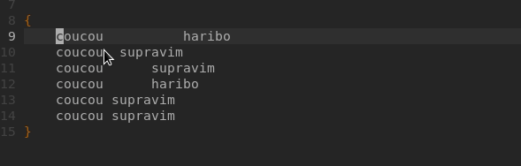

Personellement dans les documentation, j'adore les parties Astuces donc voici les miennes:

## Makefile

vous avez un snippet makefile_c et makefile_cpp pour faire un makefile rapidement !

## SupraNorme

vous pouvez le desactiver par default avec ``supravim -d norme``

la touche ``<F3>`` permet de le desactiver temporairement pour la session.

## Info sur fonction

faites ctrl+Space et vous aurez plus d'information sur cette fonction !
Sachez egalement que les commentaires ecris au dessus de ces fonction seront afficher
dans les descriptions

## Macro

vous pouvez faire des macros avec `q` qui repetera les touches
par exemple faire une macro qui entoure un TEXTE de std::cout << std::endl;

1. Appuyez sur la touche "q" suivie de la lettre que vous souhaitez utiliser pour nommer votre macro (par exemple, "qp").

2. Appuyez sur "i" pour passer en mode insertion.

3. Saisissez std::cout <<.

4. Appuyez sur "Esc" pour revenir en mode normal.

5. Appuyez sur la touche "a" pour passer en mode insertion après le curseur.

6. Saisissez << text << std::endl.

7. Appuyez sur "Esc" pour revenir en mode normal.

8. Appuyez à nouveau sur la touche "q" pour terminer l'enregistrement de la macro.

Vous pouvez maintenant exécuter cette macro en appuyant sur "@" suivi de la lettre que vous avez choisie pour votre macro (par exemple, "@p"). Cette macro entourera automatiquement ce qui se trouve sous le curseur avec std::cout << et << text << std::endl.
