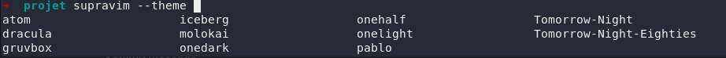
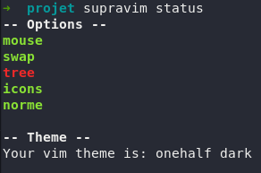
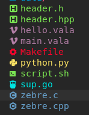
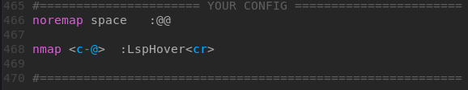

# Programme Supravim

Le programme Supravim s'utilise dans le terminal avec la commande `supravim`.
Il permet d'activer des options, de les désactiver, de changer son thème, de le mettre à jour ou de le désinstaller.
Vous pouvez également utiliser `supravim switch` pour passer d'une session Supravim à Vim Simple et inversement.

# Themes

`supravim --theme onedark` pour passer au theme onedark  (gruvbox) est par default.

Listes des themes:
``atom, gruvbox, molokai, onehalf, pablo, Tomorrow-Night-Eighties, dracula, iceberg, onedark, onelight, Tomorrow-Night``



# Options

n'hésitez pas à regarder ``supravim --status`` pour voir les options activé ou désactivé par default.



| Options | Utilisation |
| ------ | ------ |
| tree |  l'Arbre des dossier a gauche |
| mouse | prise en charge de la souris |
| swap | Ne cree plus de .swp .swo |
| icons | Des icons un peu partout ! |
| norme | Desactive supranorme par default |


Pour desactiver l'arbre des dossiers au lancement d'un vim.
``supravim --disable tree``
retirera l'arbre de dossier à gauche par défault.

# Icons
``supravim --enable icons``
activera la prise en charge des icone.



# Ajouter des lignes VIMRC

Il y a une balise à la fin du ```~/.vimrc```
ou vous pouvez mettre vos lignes de vimrc, celle-ci seront sauvegarder
a chaque mise a jour de supravim.



