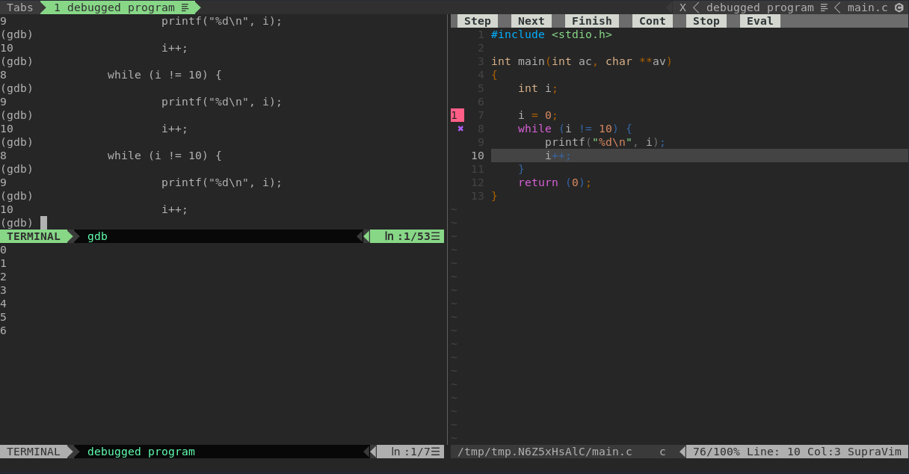

Le débogage s'effectue avec CTRL-F5.
N'oubliez pas de compiler avec les flags `-g` ou `-g3` pour obtenir des informations plus approfondies.

Si votre programme est lancé via un makefile, Vim ne trouvera pas votre exécutable, il faudra le fournir à gdb avec `file monexe`.

Vous pouvez également quitter le mode avec Ctrl+Q tout comme le terminal.

# En bref

- Compiler avec -g
- Faites Ctrl+F5 pour lancer le debugger
- entrer la commande ``file chemin/de/votre/executable``
  par exemple ``file ../a.out``
- Et c'est tout ! Bon deboguage 

