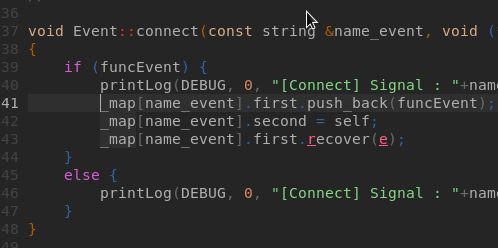
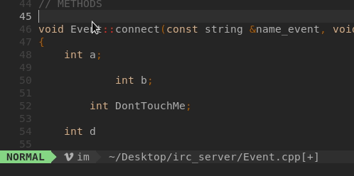
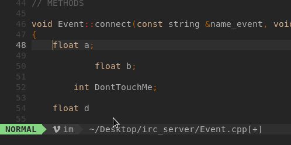

Vim ne possede pas de fonction MultiCursor par default car il est possible d'utiliser d'autre technique de substitution tout aussi puissante.

# MultiLigne

- Activer le VisualBlock et selectionner plusieurs lignes
- Shift - I
- Editer vos modification et entrer <Echap> ou sauvegarder avec ctrl+S

```vim
(<Ctrl>+V)(Shift>+I)coucou(<Esc>)
```




# MultiWord

- faites une recherche de ce que vous voulez changer par exemple /int
- faites les touches `cgn`
- Modifiez, quand vous avez terminé faites <Echap>
- Faites `.` pour appliquer a la prochaine occurence
- Faites `n` pour sauter une occurence
```vim
/int<Enter>cgn float<Echap>..n.
```



# Substitution

Vous pouvez également séléctionner du texte et faire un recherche/remplace

- Activer Visual Line (Shift-V) ou Selectionner avec la souris.
- aussitôt faites `:`
- cela devrait ressembler a ``:'<,'>s/``
- pour changer float en int ce sera ``:'<,'>s/float/int``



