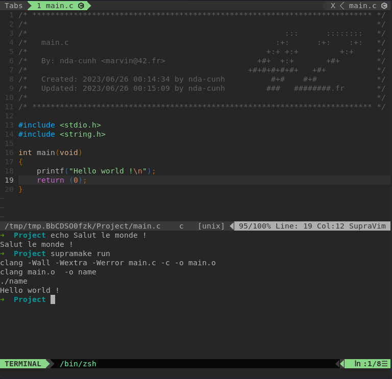

### Et oui Supravim a un mini terminal

pour y acceder : **`<Shift + t>`**

pour lire l'historique repasser en mode normal avec **`<Echap>`** et remonter le files, vous pouvez uniquement taper des commandes en mode **`i`**

**`<Ctrl + Q>`** ou la commande **`q`** pour le fermer

vous pouvez executer les regles **`run run2 run3`** de votre makefile avec les touches **F5**, **F6**, **F7**

