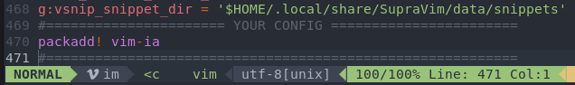

# Github Copilot

Installer avec la commande ou via l'interface graphique de supravim dans la partie plugin 

```
suprapack add plugin-github-copilot
```

Vous n'avez plus qu'a suivre les instruction de configuration en tapant la commande sur vim

`:Copilot setup`

# vim-ia

l'url est ici : https://github.com/madox2/vim-ai

Cree le dossier pack/download/opt `mkdir -p $HOME/.vim/pack/downloads/opt`

ensuite cloner dans ce dossier l'url du plugin

`git clone https://github.com/madox2/vim-ai ~/.vim/pack/download/opt/vim-ia` 

et ajouter dans votre YOUR-CONFIG dans votre \~/.vimrc

`packadd! vim-ia`

{width=645 height=95}