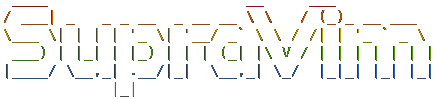
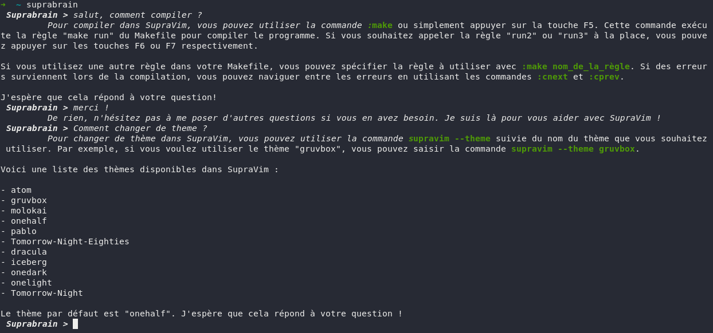

# Wiki

- ### [Raccourcis](Raccourcis)
- ### [Compilation (F5, F6, F7)](Compilation)
- ### [Debug gdb](Debug)
- ### [MultiCursor](MultiCursor)
- ### [Modifier, customiser](Customisation)
- ### [Terminal](Terminal)
- ### [D'autre langue ? comme python / TS](LSP)
- ### [Github/Gitlab Copilot | vim-IA](copilot)
- ### [Astuce](Astuce)

# Beta suprabrain GPT-3.1

Suprabrain une IA pour supravim , demandez lui de l'aide pour supravim !

